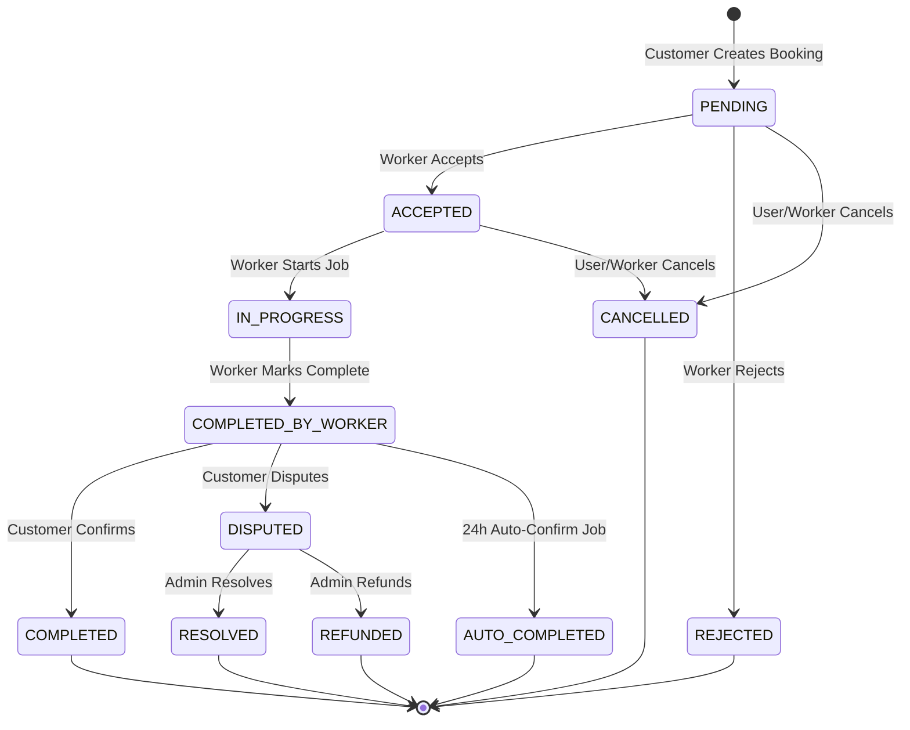

# 📅 TaskLync Booking Service — Customer API Specification & Integration Guide

> **Author:** Principal Backend Engineer  
> **Target Audience:** Customer Mobile Engineers (React Native / Flutter / Native iOS & Android), Web Integrators, QA & Backend Engineers  
> **Service Name:** `booking-service`  
> **Specification Version:** 2.0.0  
> **Gateway Base Route:** `/api/v1/bookings`  

---

## 📋 Table of Contents
1. [Architecture & System Overview](#1-architecture--system-overview)
2. [Global Standards, Authentication & Headers](#2-global-standards-authentication--headers)
3. [Booking Lifecycle & State Machine](#3-booking-lifecycle--state-machine)
4. [Pricing Engine & Fee Structure](#4-pricing-engine--fee-structure)
5. [Cancellation & Refund Policy](#5-cancellation--refund-policy)
6. [Customer API Endpoint Specifications](#6-customer-api-endpoint-specifications)
   - [6.1 Get Price Estimate (`GET /api/v1/bookings/estimate`)](#61-get-price-estimate-get-apiv1bookingsestimate)
   - [6.2 Create Booking (`POST /api/v1/bookings`)](#62-create-booking-post-apiv1bookings)
   - [6.3 List Customer Bookings (`GET /api/v1/bookings`)](#63-list-customer-bookings-get-apiv1bookings)
   - [6.4 Get Booking Details (`GET /api/v1/bookings/:id`)](#64-get-booking-details-get-apiv1bookingsid)
   - [6.5 Track Booking (`GET /api/v1/bookings/:id/track`)](#65-track-booking-get-apiv1bookingsidtrack)
   - [6.6 Cancel Booking (`PATCH /api/v1/bookings/:id/cancel`)](#66-cancel-booking-patch-apiv1bookingsidcancel)
   - [6.7 Confirm Booking Completion (`PATCH /api/v1/bookings/:id/confirm`)](#67-confirm-booking-completion-patch-apiv1bookingsidconfirm)
   - [6.8 Open Dispute (`POST /api/v1/bookings/:id/dispute`)](#68-open-dispute-post-apiv1bookingsiddispute)
   - [6.9 View Dispute (`GET /api/v1/bookings/:id/dispute`)](#69-view-dispute-get-apiv1bookingsiddispute)
7. [Customer App Integration Guide & Client Implementation](#7-customer-app-integration-guide--client-implementation)

---

## 1. Architecture & System Overview

`booking-service` (Port `3004`) manages the core booking lifecycle, pricing calculation engine, state transitions, auto-expiry jobs, cancellations, and dispute workflows for the TaskLync platform.

### Communication Topology
* **Public Gateway Traffic:** All requests enter via the **API Gateway** (`:3000`). Clients never call `booking-service` directly.
* **Internal Sync Dependencies:** `booking-service` synchronously verifies worker status via `worker-service` (`:3003`).
* **Asynchronous Event Emission:** Booking state transitions produce Kafka events on topic `booking.events` and trigger notification jobs on `notification.send`.

```
┌─────────────────────────────────┐
│       Customer Client App       │
└────────────────┬────────────────┘
                 │ HTTPS (REST API)
                 ▼
┌─────────────────────────────────┐
│      TaskLync API Gateway       │ (Port 3000)
│   (JWT Check & Rate Limiting)   │
└────────────────┬────────────────┘
                 │ Internal HTTP Proxy
                 ▼
┌─────────────────────────────────┐
│         Booking Service         │ (Port 3004)
└───────┬─────────────────┬───────┘
        │                 │
        ▼                 ▼
 ┌─────────────┐   ┌─────────────┐
 │ PostgreSQL  │   │ Redis Cache │
 │ (Supabase)  │   │  & BullMQ   │
 └─────────────┘   └─────────────┘
```

---

## 2. Global Standards, Authentication & Headers

### 2.1 Base URLs

| Environment | Base URL |
| :--- | :--- |
| **Local Development** | `http://localhost:3000/api/v1/bookings` |
| **Staging / QA** | `https://staging-api.tasklync.pk/api/v1/bookings` |
| **Production** | `https://api.tasklync.pk/api/v1/bookings` |

### 2.2 Standard Headers

| Header Name | Data Type | Required | Description |
| :--- | :--- | :--- | :--- |
| `Authorization` | String | **Required** | Access Token: `Bearer <jwt_token>` |
| `Content-Type` | String | **Required** | `application/json` |
| `Accept` | String | **Required** | `application/json` |
| `x-request-id` | String | Optional | `uuid-v4` trace identifier |

### 2.3 Response Envelopes

#### Success Envelope
```json
{
  "status": "success",
  "data": { ... },
  "message": "Operation completed successfully",
  "meta": {
    "total": 45,
    "page": 1,
    "limit": 20,
    "total_pages": 3,
    "has_next": true,
    "has_prev": false
  }
}
```

#### Error Envelope
```json
{
  "status": "error",
  "code": "BOOKING_NOT_FOUND",
  "message": "Booking with ID 'b9283f51-6c1d-4e2b-9204-7a18f8e12345' was not found"
}
```

---

## 3. Booking Lifecycle & State Machine

### 3.1 Status Matrix (`BookingStatus`)

| Status | Meaning | Next Valid Transitions |
| :--- | :--- | :--- |
| `PENDING` | Booking created, awaiting worker acceptance. | `ACCEPTED`, `REJECTED`, `CANCELLED` |
| `ACCEPTED` | Worker accepted the booking. | `IN_PROGRESS`, `CANCELLED` |
| `REJECTED` | Worker rejected the booking request. | *(Terminal State)* |
| `IN_PROGRESS` | Worker checked in and started work. | `COMPLETED_BY_WORKER` |
| `COMPLETED_BY_WORKER` | Worker marked job done; pending customer confirmation. | `COMPLETED`, `DISPUTED`, `AUTO_COMPLETED` |
| `COMPLETED` | Customer confirmed job completion. | *(Terminal State)* |
| `AUTO_COMPLETED` | System automatically confirmed job completion after window. | *(Terminal State)* |
| `DISPUTED` | Customer opened a dispute. | `RESOLVED`, `REFUNDED` |
| `RESOLVED` | Admin resolved dispute without full refund. | *(Terminal State)* |
| `REFUNDED` | Admin granted full/partial refund. | *(Terminal State)* |
| `CANCELLED` | Booking cancelled by user or worker. | *(Terminal State)* |



---

## 4. Pricing Engine & Fee Structure

The booking price is calculated dynamically using base rates from the service catalog / worker custom offerings and applying situational multipliers.

$$\text{Base Total} = \begin{cases} \text{base\_price} \times \text{duration\_hours} & \text{if price\_type} = \text{'hourly'} \\ \text{base\_price} & \text{if price\_type} = \text{'fixed'} \end{cases}$$

$$\text{Estimated Total} = \text{Base Total} \times \text{urgency\_multiplier} \times \text{demand\_multiplier} \times \text{time\_of\_day\_multiplier}$$

| Parameter / Multiplier | Range / Default | Description |
| :--- | :--- | :--- |
| `urgency_multiplier` | `1.0` - `1.5` | `1.5x` if scheduled within 2 hours or flagged urgent; `1.2x` if same day. |
| `demand_multiplier` | `1.0` - `1.3` | Surge multiplier applied when available workers in area are below threshold. |
| `time_of_day_multiplier` | `1.0` - `1.25` | Off-peak / late-night service rate adjustment (10:00 PM – 6:00 AM PKT). |
| `platform_fee` | `15%` | Platform commission subtracted from `estimated_total`. |
| `worker_amount` | `85%` | Net payout allocated to worker. |

---

## 5. Cancellation & Refund Policy

Cancellation refund percentage depends on the booking stage and notice period:

| Booking Stage | Notice Window | Refund Percentage | Penalty |
| :--- | :--- | :--- | :--- |
| `PENDING` | Anytime before worker acceptance | **100% Refund** | 0% |
| `ACCEPTED` | More than 24 hours before `scheduled_at` | **90% Refund** | 10% Cancellation Fee |
| `ACCEPTED` | Less than 24 hours before `scheduled_at` | **50% Refund** | 50% Late Cancellation Fee |
| `IN_PROGRESS` | During active service | **0% Refund via API** | Must use Dispute route |

---

## 6. Customer API Endpoint Specifications

### 6.1 Get Price Estimate (`GET /api/v1/bookings/estimate`)

Calculates instant price estimates before placing a formal booking.

#### Query Parameters

| Parameter | Type | Required | Validation / Format | Description |
| :--- | :--- | :--- | :--- | :--- |
| `worker_id` | String | **Yes** | UUID v4 | Target worker ID |
| `category_id` | String | **Yes** | `string(1..50)` | Category identifier (e.g. `electrician`, `plumber`) |
| `service_id` | String | Optional | UUID v4 | Specific service ID |
| `scheduled_at` | String | **Yes** | ISO-8601 UTC | Scheduled start time |
| `duration_hours`| Number | **Yes** | Min `0.5`, Max `12` | Estimated duration in hours |
| `latitude` | Number | **Yes** | `-90.0` to `90.0` | Job site latitude |
| `longitude` | Number | **Yes** | `-180.0` to `180.0` | Job site longitude |
| `is_urgent` | Boolean | **Yes** | `true` or `false` | Urgent request flag |

#### Example Request
`GET /api/v1/bookings/estimate?worker_id=a1b2c3d4-e5f6-7890-abcd-ef1234567890&category_id=electrician&scheduled_at=2026-08-10T10:00:00.000Z&duration_hours=2&latitude=31.5204&longitude=74.3587&is_urgent=false`

#### Success Response (`200 OK`)
```json
{
  "status": "success",
  "message": "Price estimate calculated",
  "data": {
    "base_price": 3000.00,
    "urgency_multiplier": 1.0,
    "demand_multiplier": 1.0,
    "time_of_day_multiplier": 1.0,
    "estimated_total": 3000.00,
    "platform_fee": 450.00,
    "worker_amount": 2550.00,
    "currency": "PKR",
    "price_type": "hourly"
  }
}
```

---

### 6.2 Create Booking (`POST /api/v1/bookings`)

Creates a new booking request.

#### Request Body (`application/json`)

| Field | Type | Required | Validation / Constraints | Description |
| :--- | :--- | :--- | :--- | :--- |
| `worker_id` | String | **Yes** | Valid UUID v4 | ID of target worker |
| `category_id` | String | **Yes** | `string(1..50)` | Service category slug |
| `service_id` | String | Optional | Valid UUID v4 | Specific service ID |
| `service_type` | String | **Yes** | `ONE_TIME` or `RECURRING` | Service model |
| `scheduled_at` | String | **Yes** | Future ISO 8601 Date | Scheduled job start time |
| `duration_hours`| Number | **Yes** | `0.5` to `12.0` | Expected job duration |
| `address_id` | String | **Yes** | Valid UUID v4 | Customer saved address ID |
| `address_text` | String | **Yes** | String (5..500 chars) | Formatted address string |
| `latitude` | Number | **Yes** | `-90.0` to `90.0` | Job location latitude |
| `longitude` | Number | **Yes** | `-180.0` to `180.0` | Job location longitude |
| `is_urgent` | Boolean | **Yes** | Boolean | Urgent dispatch request |
| `description` | String | Optional | Max 1000 chars | Customer notes/instructions |

#### Example Request Payload
```json
{
  "worker_id": "a1b2c3d4-e5f6-7890-abcd-ef1234567890",
  "category_id": "electrician",
  "service_id": "f47ac10b-58cc-4372-a567-0e02b2c3d4e5",
  "service_type": "ONE_TIME",
  "scheduled_at": "2026-08-10T10:00:00.000Z",
  "duration_hours": 2,
  "address_id": "7c9e6679-7425-40de-944b-e07fc1f90ae7",
  "address_text": "House 12, Street 4, Sector F-8/2, Islamabad",
  "latitude": 33.7182,
  "longitude": 73.0605,
  "is_urgent": false,
  "description": "Short circuit in primary main breaker box"
}
```

#### Success Response (`201 Created`)
```json
{
  "status": "success",
  "message": "Booking created successfully",
  "data": {
    "id": "b9283f51-6c1d-4e2b-9204-7a18f8e12345",
    "user_id": "u9876543-2100-11ec-8d3d-0242ac130003",
    "worker_id": "a1b2c3d4-e5f6-7890-abcd-ef1234567890",
    "category_id": "electrician",
    "service_id": "f47ac10b-58cc-4372-a567-0e02b2c3d4e5",
    "service_type": "ONE_TIME",
    "status": "PENDING",
    "scheduled_at": "2026-08-10T10:00:00.000Z",
    "duration_hours": 2,
    "expires_at": "2026-08-08T15:00:00.000Z",
    "address_id": "7c9e6679-7425-40de-944b-e07fc1f90ae7",
    "address_text": "House 12, Street 4, Sector F-8/2, Islamabad",
    "job_site_location": {
      "lat": 33.7182,
      "lng": 73.0605
    },
    "base_price": 3000.00,
    "urgency_multiplier": 1.0,
    "demand_multiplier": 1.0,
    "time_of_day_multiplier": 1.0,
    "estimated_total": 3000.00,
    "platform_fee": 450.00,
    "worker_amount": 2550.00,
    "currency": "PKR",
    "price_type": "hourly",
    "is_urgent": false,
    "is_payment_confirmed": false,
    "created_at": "2026-08-08T14:30:00.000Z"
  }
}
```

---

### 6.3 List Customer Bookings (`GET /api/v1/bookings`)

Retrieves a paginated list of bookings owned by the authenticated customer.

#### Query Parameters

| Parameter | Type | Required | Default | Description |
| :--- | :--- | :--- | :--- | :--- |
| `page` | Integer | Optional | `1` | Page number |
| `limit` | Integer | Optional | `20` | Items per page (Max 100) |
| `status` | String | Optional | - | Filter by status (`PENDING`, `ACCEPTED`, `IN_PROGRESS`, `COMPLETED`, `CANCELLED`, etc.) |
| `from_date` | String | Optional | - | Start date filter (ISO-8601) |
| `to_date` | String | Optional | - | End date filter (ISO-8601) |

#### Example Request
`GET /api/v1/bookings?page=1&limit=10&status=COMPLETED`

#### Success Response (`200 OK`)
```json
{
  "status": "success",
  "data": [
    {
      "id": "b9283f51-6c1d-4e2b-9204-7a18f8e12345",
      "category_id": "electrician",
      "status": "COMPLETED",
      "scheduled_at": "2026-08-05T10:00:00.000Z",
      "estimated_total": 3000.00,
      "currency": "PKR",
      "address_text": "House 12, Street 4, Sector F-8/2, Islamabad",
      "created_at": "2026-08-05T08:00:00.000Z"
    }
  ],
  "meta": {
    "total": 1,
    "page": 1,
    "limit": 10,
    "total_pages": 1,
    "has_next": false,
    "has_prev": false
  }
}
```

---

### 6.4 Get Booking Details (`GET /api/v1/bookings/:id`)

Fetches detailed information for a single booking by ID.

#### Path Parameters

| Parameter | Type | Required | Description |
| :--- | :--- | :--- | :--- |
| `id` | String | **Yes** | Booking UUID v4 |

#### Success Response (`200 OK`)
```json
{
  "status": "success",
  "data": {
    "id": "b9283f51-6c1d-4e2b-9204-7a18f8e12345",
    "user_id": "u9876543-2100-11ec-8d3d-0242ac130003",
    "worker_id": "a1b2c3d4-e5f6-7890-abcd-ef1234567890",
    "category_id": "electrician",
    "status": "ACCEPTED",
    "scheduled_at": "2026-08-10T10:00:00.000Z",
    "duration_hours": 2,
    "address_text": "House 12, Street 4, Sector F-8/2, Islamabad",
    "estimated_total": 3000.00,
    "currency": "PKR",
    "is_payment_confirmed": true,
    "description": "Short circuit in primary main breaker box",
    "created_at": "2026-08-08T14:30:00.000Z"
  }
}
```

---

### 6.5 Track Booking (`GET /api/v1/bookings/:id/track`)

Lightweight polling endpoint to track real-time status during an active booking.

#### Path Parameters

| Parameter | Type | Required | Description |
| :--- | :--- | :--- | :--- |
| `id` | String | **Yes** | Booking UUID v4 |

#### Success Response (`200 OK`)
```json
{
  "status": "success",
  "data": {
    "booking_id": "b9283f51-6c1d-4e2b-9204-7a18f8e12345",
    "status": "IN_PROGRESS",
    "scheduled_at": "2026-08-10T10:00:00.000Z",
    "started_at": "2026-08-10T10:02:15.000Z",
    "worker_id": "a1b2c3d4-e5f6-7890-abcd-ef1234567890"
  }
}
```

---

### 6.6 Cancel Booking (`PATCH /api/v1/bookings/:id/cancel`)

Cancels an active booking in `PENDING` or `ACCEPTED` status.

#### Request Body

| Field | Type | Required | Validation | Description |
| :--- | :--- | :--- | :--- | :--- |
| `reason` | String | **Yes** | String (1..500 chars) | Reason for cancellation |

```json
{
  "reason": "Plans changed, work no longer required"
}
```

#### Success Response (`200 OK`)
```json
{
  "status": "success",
  "message": "Booking cancelled",
  "data": {
    "id": "b9283f51-6c1d-4e2b-9204-7a18f8e12345",
    "status": "CANCELLED",
    "cancellation_reason": "Plans changed, work no longer required",
    "cancelled_by": "user",
    "updated_at": "2026-08-08T14:45:00.000Z"
  }
}
```

---

### 6.7 Confirm Booking Completion (`PATCH /api/v1/bookings/:id/confirm`)

Called by customer to verify completion when worker marks job as `COMPLETED_BY_WORKER`. Triggers escrow release to worker.

#### Success Response (`200 OK`)
```json
{
  "status": "success",
  "message": "Booking confirmed as completed",
  "data": {
    "id": "b9283f51-6c1d-4e2b-9204-7a18f8e12345",
    "status": "COMPLETED",
    "completed_at": "2026-08-10T12:00:00.000Z"
  }
}
```

---

### 6.8 Open Dispute (`POST /api/v1/bookings/:id/dispute`)

Opens a formal dispute on a booking in `COMPLETED_BY_WORKER` state.

#### Request Body

| Field | Type | Required | Validation | Description |
| :--- | :--- | :--- | :--- | :--- |
| `reason` | String | **Yes** | String (10..1000 chars) | Explanation of dispute |
| `evidence_urls` | Array of Strings | Optional | Max 5 valid URLs | Cloudinary image/video proof URLs |

```json
{
  "reason": "Worker damaged the wall switch during repair and left job incomplete.",
  "evidence_urls": [
    "https://res.cloudinary.com/tasklync/image/upload/v1234567/evidence1.jpg"
  ]
}
```

#### Success Response (`200 OK`)
```json
{
  "status": "success",
  "message": "Dispute created successfully",
  "data": {
    "id": "d1122334-4455-6677-8899-aabbccddeeff",
    "booking_id": "b9283f51-6c1d-4e2b-9204-7a18f8e12345",
    "raised_by": "u9876543-2100-11ec-8d3d-0242ac130003",
    "raised_against": "a1b2c3d4-e5f6-7890-abcd-ef1234567890",
    "status": "OPEN",
    "reason": "Worker damaged the wall switch during repair and left job incomplete.",
    "evidence_urls": [
      "https://res.cloudinary.com/tasklync/image/upload/v1234567/evidence1.jpg"
    ],
    "created_at": "2026-08-10T12:30:00.000Z"
  }
}
```

---

### 6.9 View Dispute (`GET /api/v1/bookings/:id/dispute`)

Retrieves dispute details and status for a given booking.

#### Success Response (`200 OK`)
```json
{
  "status": "success",
  "data": {
    "id": "d1122334-4455-6677-8899-aabbccddeeff",
    "booking_id": "b9283f51-6c1d-4e2b-9204-7a18f8e12345",
    "status": "WORKER_RESPONDED",
    "reason": "Worker damaged wall switch",
    "worker_response": "Damage was pre-existing before work began.",
    "created_at": "2026-08-10T12:30:00.000Z"
  }
}
```

---

## 7. Customer App Integration Guide & Client Implementation

Below is a production-ready JavaScript/TypeScript implementation for connecting customer mobile (React Native / Expo) or web clients to `booking-service`.

```typescript
import axios, { AxiosInstance, AxiosError } from 'axios';

export interface PriceEstimateParams {
  worker_id: string;
  category_id: string;
  service_id?: string;
  scheduled_at: string;
  duration_hours: number;
  latitude: number;
  longitude: number;
  is_urgent: boolean;
}

export interface CreateBookingParams {
  worker_id: string;
  category_id: string;
  service_id?: string;
  service_type: 'ONE_TIME' | 'RECURRING';
  scheduled_at: string;
  duration_hours: number;
  address_id: string;
  address_text: string;
  latitude: number;
  longitude: number;
  is_urgent: boolean;
  description?: string;
}

export class TaskLyncBookingClient {
  private client: AxiosInstance;

  constructor(baseURL: string, private getAuthToken: () => Promise<string | null>) {
    this.client = axios.create({
      baseURL: `${baseURL}/api/v1/bookings`,
      timeout: 10000,
      headers: {
        'Content-Type': 'application/json',
        'Accept': 'application/json',
      },
    });

    // Request interceptor to inject Authorization Bearer token
    this.client.interceptors.request.use(async (config) => {
      const token = await this.getAuthToken();
      if (token) {
        config.headers.Authorization = `Bearer ${token}`;
      }
      return config;
    });
  }

  /**
   * Fetch price estimate prior to booking placement
   */
  async getPriceEstimate(params: PriceEstimateParams) {
    try {
      const response = await this.client.get('/estimate', { params });
      return response.data.data;
    } catch (error) {
      this.handleError(error as AxiosError);
    }
  }

  /**
   * Create a new booking
   */
  async createBooking(payload: CreateBookingParams) {
    try {
      const response = await this.client.post('/', payload);
      return response.data.data;
    } catch (error) {
      this.handleError(error as AxiosError);
    }
  }

  /**
   * List customer bookings with pagination & filters
   */
  async listBookings(page = 1, limit = 20, status?: string) {
    try {
      const response = await this.client.get('/', {
        params: { page, limit, status },
      });
      return response.data;
    } catch (error) {
      this.handleError(error as AxiosError);
    }
  }

  /**
   * Cancel an active booking
   */
  async cancelBooking(bookingId: string, reason: string) {
    try {
      const response = await this.client.patch(`/${bookingId}/cancel`, { reason });
      return response.data.data;
    } catch (error) {
      this.handleError(error as AxiosError);
    }
  }

  /**
   * Confirm job completion
   */
  async confirmCompletion(bookingId: string) {
    try {
      const response = await this.client.patch(`/${bookingId}/confirm`);
      return response.data.data;
    } catch (error) {
      this.handleError(error as AxiosError);
    }
  }

  /**
   * Standardized error handling
   */
  private handleError(error: AxiosError): never {
    if (error.response) {
      const errorData = error.response.data as any;
      throw new Error(errorData.message || `Booking API error: ${error.response.status}`);
    } else if (error.request) {
      throw new Error('Network error: No response received from API Gateway');
    } else {
      throw new Error(error.message);
    }
  }
}
```
