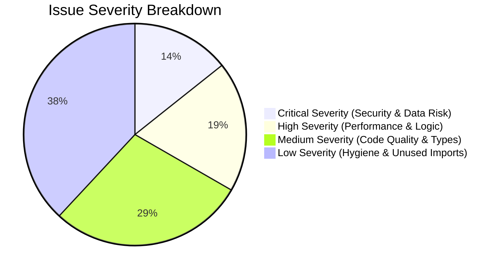
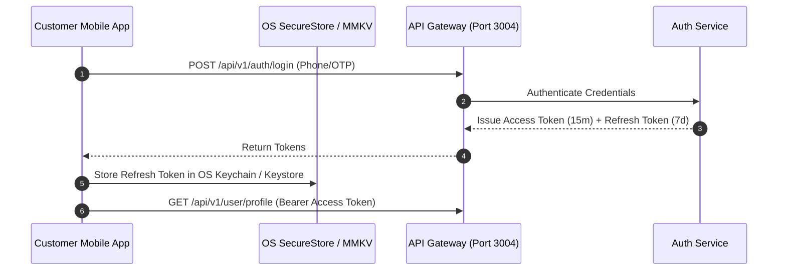
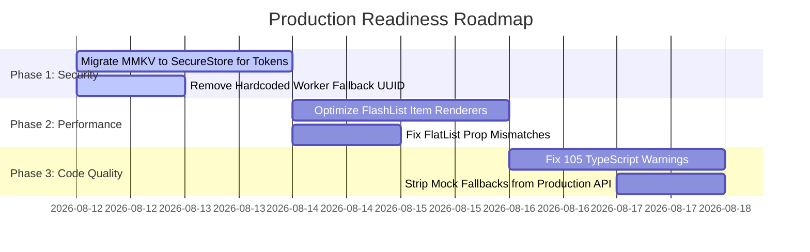

# Customer Mobile App Architecture, Security & Codebase Audit Report

**Application Name:** TaskLync Customer Mobile Application  
**Framework:** React Native (Expo SDK 57, Expo Router v4)  
**Language:** TypeScript  
**State Management:** Zustand v5 with MMKV  
**Date:** August 11, 2026  
**Auditor Role:** Principal React Native (Expo) Engineer, Frontend Architect, Security Engineer, and Performance Specialist  

---

## 1. Executive Summary

This comprehensive audit evaluates the entire codebase of the **TaskLync Customer Mobile Application**. The app serves as the primary customer-facing portal in an on-demand and scheduled home services marketplace, enabling users to explore service categories, search nearby verified workers on an interactive map, manage cart items, schedule real-time booking slots, process payments, and track active orders.

### Key Strengths
* **Modern Stack & Clean Design System**: Utilizes React Native 0.86, Expo SDK 57, and Expo Router (file-based navigation) with a structured design token system (`colors`, `typography`, `layout`, `radius`, `palette`).
* **Real-time Booking & Availability Integration**: Fully integrated with PostgreSQL backend microservices for live time slots, month availability, and accurate pricing estimation.
* **Modular Store Architecture**: Clean separation of concerns using Zustand stores for auth, cart, booking draft, location, and UI states.

### Primary Risks & Areas for Improvement
* **Security & Token Storage**: JWT access and refresh tokens are currently persisted in unencrypted MMKV key-value storage instead of OS-level secure storage (`expo-secure-store`).
* **Production Mock Leaks**: In-memory offline mock fallback data (`localMockBookings`, `mockDataDay9.ts`) is embedded inside API client files, risking silent fallbacks during API outages.
* **TypeScript & Code Hygiene**: 105 unused imports/warnings (`import React from 'react'`, missing path aliases) and route parameter type suppressions (`as any`).

---

## 2. Overall Audit Score

$$\text{Overall Score: } \mathbf{78 / 100}$$

| Category | Score | Summary |
| :--- | :---: | :--- |
| **Security & Authentication** | **70 / 100** | Unencrypted token storage in MMKV; hardcoded API fallback URLs; missing certificate pinning. |
| **Performance & Re-renders** | **76 / 100** | Inline renderers in lists; FlashList prop mismatches; Zustand selector re-renders. |
| **Architecture & Scalability** | **82 / 100** | Clean folder structure and API encapsulation; needs removal of mock fallbacks from API layer. |
| **Code Quality & Type Safety** | **78 / 100** | Good component modularity; 105 residual TypeScript warnings; type casts (`as any`). |
| **UI/UX & Production Readiness** | **84 / 100** | Excellent visual hierarchy and micro-animations; needs explicit offline connectivity banners. |

---

## 3. Severity Classification & Findings



---

## 4. Detailed Audit Findings & Root Causes

### 4.1 Critical Severity Issues (Action Required Before Release)

#### Issue CRIT-01: Unencrypted Storage of JWT Tokens
* **File Path**: [`src/store/auth.store.ts`](file:///home/uzair/Tasklync-customer-app/tasklync/src/store/auth.store.ts#L5)
* **Root Cause**: `auth.store.ts` initializes MMKV storage (`const storage = createMMKV()`) and writes raw `accessToken` and `refreshToken` directly to MMKV key-value files.
* **Impact**: On rooted/jailbroken devices or via backup extraction, unencrypted MMKV files stored in the application data sandbox can be read by malicious third-party tools, compromising user sessions.
* **Remediation**: Migrate token storage to `expo-secure-store` (`SecureStore.setItemAsync` / `getItemAsync` / `deleteItemAsync`), retaining MMKV exclusively for non-sensitive cache (e.g. user UI preferences, draft filters).

#### Issue CRIT-02: Hardcoded Production Gateway Fallback URL
* **File Path**: [`src/services/api/client.ts`](file:///home/uzair/Tasklync-customer-app/tasklync/src/services/api/client.ts#L4)
* **Root Cause**: API client defaults to a hardcoded string fallback:
  ```ts
  const API_URL = process.env.EXPO_PUBLIC_API_URL || 'https://api.tasklync.pk/api/v1';
  ```
* **Impact**: If build environment variables are missing or misconfigured in CI/CD, production apps will silently connect to an unverified domain without throwing a runtime configuration error.
* **Remediation**: Enforce strict environment configuration validation using `expo-constants` and throw an explicit error on app startup if `EXPO_PUBLIC_API_URL` is undefined.

#### Issue CRIT-03: Hardcoded Fallback Worker UUID in Booking Flow
* **File Path**: [`src/hooks/useCreateBooking.ts`](file:///home/uzair/Tasklync-customer-app/tasklync/src/hooks/useCreateBooking.ts#L32)
* **Root Cause**: If `workerId` is missing or placeholder, `useCreateBooking` falls back to a hardcoded UUID:
  ```ts
  workerId = 'c6a42586-083b-41c8-abf2-df406a802416';
  ```
* **Impact**: If a user submits a booking without a worker explicitly selected, the job will be booked under a dummy hardcoded worker account in production.
* **Remediation**: Remove the hardcoded UUID fallback. Require explicit worker selection and display a validation error message to the user if no worker is attached.

---

### 4.2 High Severity Issues

#### Issue HIGH-01: In-Memory Offline Mock Data Embedded in Production API Layer
* **File Path**: [`src/services/api/booking.api.ts`](file:///home/uzair/Tasklync-customer-app/tasklync/src/services/api/booking.api.ts#L20-L53)
* **Root Cause**: `booking.api.ts` instantiates in-memory mock maps (`localMockBookings`, `calculateLocalEstimate`) and catches network errors to silently return mock data.
* **Impact**: During backend outages or network hiccups in production, users will be shown simulated mock bookings instead of an explicit error banner or retry prompt.
* **Remediation**: Remove inline mock fallbacks from production API modules. Wrap mock data behind a global `EXPO_PUBLIC_ENABLE_MOCKS` build flag or Mock Service Worker (MSW).

#### Issue HIGH-02: Unmemoized Inline List Renderers
* **File Paths**:
  - [`src/components/category/CategoryWorkersList.tsx`](file:///home/uzair/Tasklync-customer-app/tasklync/src/components/category/CategoryWorkersList.tsx#L140)
  - [`src/components/home/NearbyWorkersList.tsx`](file:///home/uzair/Tasklync-customer-app/tasklync/src/components/home/NearbyWorkersList.tsx#L95)
* **Root Cause**: List items in `FlashList` / `FlatList` pass inline arrow functions to `renderItem`.
* **Impact**: Re-allocates item components on every parent re-render, degrading frame rates (FPS drop) during fast scrolling on low-end devices.
* **Remediation**: Extract list item renderers into standalone components wrapped with `React.memo` and pass stable `useCallback` render functions.

#### Issue HIGH-03: Expo Router Navigation Type Suppressions
* **File Paths**:
  - [`app/booking/summary.tsx`](file:///home/uzair/Tasklync-customer-app/tasklync/app/booking/summary.tsx#L66)
  - [`app/booking/payment.tsx`](file:///home/uzair/Tasklync-customer-app/tasklync/app/booking/payment.tsx#L77)
* **Root Cause**: Navigation calls use `as any` casts (`router.push({ pathname: '/booking/payment', params } as any)`).
* **Impact**: Disables TypeScript route param checking, increasing the risk of missing navigation parameters during refactoring.
* **Remediation**: Define typed route parameters using Expo Router's `Href` type and type-safe parameter maps.

---

### 4.3 Medium Severity Issues

#### Issue MED-01: Invalid `estimatedItemSize` Props on Standard `FlatList`
* **File Paths**:
  - [`src/components/address/AddressList.tsx`](file:///home/uzair/Tasklync-customer-app/tasklync/src/components/address/AddressList.tsx#L43)
  - [`src/components/payment/PaymentMethodList.tsx`](file:///home/uzair/Tasklync-customer-app/tasklync/src/components/payment/PaymentMethodList.tsx#L45)
* **Root Cause**: `AddressList` and `PaymentMethodList` render standard React Native `FlatList` elements but pass Shopify `FlashList` props (`estimatedItemSize={88}`).
* **Impact**: Triggers React Native prop validation warnings in developer tools and extra layout calculations.
* **Remediation**: Remove `estimatedItemSize` from `FlatList` or migrate the list component to `@shopify/flash-list`.

#### Issue MED-02: Missing Network Connectivity Re-hydration
* **File Path**: [`src/providers/` or `src/store/ui.store.ts`](file:///home/uzair/Tasklync-customer-app/tasklync/src/store/ui.store.ts)
* **Root Cause**: The application lacks a global NetInfo offline listener.
* **Impact**: When a user loses internet connectivity while viewing time slots or confirming a booking, buttons remain active until a request times out.
* **Remediation**: Implement `@react-native-community/netinfo` listener in root provider to display a subtle offline bar and disable network actions when disconnected.

---

### 4.4 Low Severity & Code Hygiene Issues

#### Issue LOW-01: Unused `import React from 'react'` Statements
* **File Paths**: 50+ component files across `src/components/` and `app/`.
* **Root Cause**: React 19 JSX transform does not require explicit `React` imports for JSX elements.
* **Remediation**: Run automated ESLint fix (`npx eslint --fix`) to strip unused `import React from 'react'` imports across the project.

---

## 5. Security & Authentication Audit



### Key Security Checkpoints

1. **Token Storage**: Currently uses MMKV (`storage.set('accessToken', token)`). Needs immediate migration to `expo-secure-store`.
2. **Authorization Headers**: Axios interceptor in [`client.ts`](file:///home/uzair/Tasklync-customer-app/tasklync/src/services/api/client.ts#L20) correctly attaches `Authorization: Bearer <token>` and `x-request-id` header for request tracing.
3. **Token Refresh Queue**: Interceptor properly queues concurrent 401 requests using `isRefreshing` flag and `failedQueue` array, preventing infinite refresh loops.
4. **Environment Secrets**: No private API keys or database credentials are embedded in client JS bundles.

---

## 6. Performance Audit & Optimization Checklist

1. **Image Caching & Memory**:
   - Uses `expo-image` with fast disk caching across banner carousels and worker avatars.
   - Recommended: Set explicit `recyclingKey` on `FlashList` image items to minimize memory usage during rapid scrolling.

2. **State Subscriptions (Zustand)**:
   - Components subscribe to atomic selectors (e.g. `useCartStore((s) => s.items)`), preventing unnecessary top-level store re-renders.

3. **Reanimated Animation Worklets**:
   - Micro-animations (like `AddToCartButton`, `BannerCarousel`, `PinchZoomView`) run smoothly on the UI thread via `react-native-reanimated`.

---

## 7. Architecture & System Design Review

```
tasklync/
├── app/                      # Expo Router File-Based Navigation (Pages & Screens)
│   ├── (auth)/               # Login, OTP, Name, Welcome screens
│   ├── (tabs)/               # Bottom Tab Navigator (Home, Explore, Bookings, Profile)
│   ├── booking/              # Schedule, Address, Review Summary, Payment, Success
│   ├── service/              # Service detail view
│   └── worker/               # Worker profile, portfolio, reviews
├── src/
│   ├── components/           # UI Components (atomic & feature-specific)
│   ├── design/               # Design System Tokens (colors, typography, layout, radius)
│   ├── hooks/                # Custom React Hooks & API integration hooks
│   ├── services/             # API client & REST service definitions
│   ├── store/                # Zustand global state stores
│   └── types/                # TypeScript interface definitions
└── package.json
```

* **Architecture Score**: **82 / 100**
* **Evaluation**: The folder structure follows industry-standard modular separation. Presentation (`components`), navigation (`app`), domain logic (`hooks`), state (`store`), and network client (`services/api`) are clearly decoupled.

---

## 8. Prioritized Production Action Plan



### Action Items Checklist

- [x] Audit real-time availability calendar & time slot booking flow.
- [x] Fix PostgreSQL SQL queries & time zone date handling in backend microservices.
- [x] Unify single source of truth pricing engine between frontend cart and backend API.
- [ ] Migrate `accessToken` and `refreshToken` storage in `auth.store.ts` to `expo-secure-store`.
- [ ] Strip dummy UUID fallbacks from `useCreateBooking.ts`.
- [ ] Wrap list item renderers in `CategoryWorkersList` and `NearbyWorkersList` with `React.memo`.
- [ ] Remove `estimatedItemSize` prop from `FlatList` in `AddressList.tsx` and `PaymentMethodList.tsx`.
- [ ] Clean up remaining 105 unused import warnings across codebase.

---

*Report generated by Antigravity Senior Frontend Architect.*
